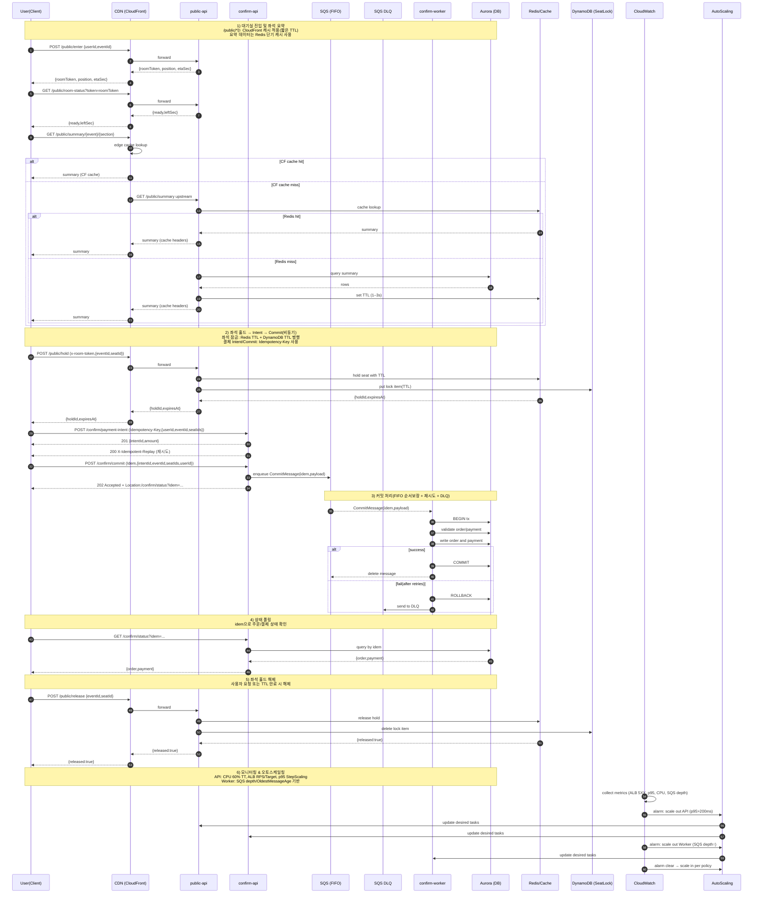

# 현재 디자인 단계입니다. 25.08.14

# aws-ticket-tps-example (max-tps-ecs)

ECS Fargate + ALB + CloudFront + Redis + SQS + DynamoDB + Aurora PostgreSQL Serverless v2로
단일 AWS 계정 · 2개 리전(ap-northeast-1, ap-northeast-2)에서 **고 TPS(100k+)**를 목표로 하는 예제입니다.

- 설계 목표: 외부 체감 100,000+ TPS, p95 ≤ 200ms(핫패스), 무중단 확장/축소
- 아키텍처 구성, 오토스케일링, 캐시/락 설계, E2E 시나리오로 검증
- [requirement.md](./requirement.md) 참조

## 레포 구조

```
aws-ticket-tps-example/
├── .github/workflows/ # GitHub Actions CI/CD 워크플로우
│ └── cicd.yml
│
├── apps/ # 서비스 애플리케이션
│ ├── confirm-api/ # 결제 확인 API
│ │ ├── Dockerfile
│ │ ├── package.json
│ │ └── src/ # API 라우트 및 SQS 연동
│ ├── confirm-worker/ # 결제 처리 워커
│ │ ├── Dockerfile
│ │ ├── package.json
│ │ └── src/ # DB 연동 및 워커 로직
│ └── public-api/ # 공개 API 서비스
│   ├── Dockerfile
│   ├── package.json
│   └── src/ # API 라우트 및 Redis 캐시
│
├── infra/ # AWS 인프라 배포 스크립트
│ ├── 00_network_bootstrap.sh # 네트워크(VPC, 서브넷 등)
│ ├── 01_ecr_build_push.sh # ECR 빌드 및 푸시
│ ├── 02_cluster_and_roles.sh # ECS 클러스터/IAM 역할
│ ├── 03_data_plane.sh # SQS, DynamoDB, Redis, Aurora
│ ├── 04_task_defs.sh # ECS 태스크 정의
│ ├── 05_alb_services.sh # ALB 및 서비스 생성
│ ├── 06_autoscaling.sh # 오토스케일링 정책
│ ├── 07_cloudfront.sh # CloudFront 배포
│ └── 08_db_init.sh # DB 스키마 초기화
│
│ test/
│ ├─ e2e/                      # 계약/기능 중심 E2E 러너 (Playwright)
│ │  ├─ scripts/               # 실행 보조 유틸
│ │  ├─ helpers/               # 공통 검증/HTTP 유틸
│ │  ├─ fixtures/              # 테스트 데이터(유저/이벤트/좌석 등)
│ │  ├─ specs/                 # 스펙(스모크/계약/E2E 흐름)
│ │  └─ reports/               # Playwright HTML 리포트 출력
│ │
│ └─ loadtestbot/              # 최대 지속 TPS 산출(분산 부하 + 리포트)
│    ├─ scenarios/             # k6 시나리오
│    ├─ scripts/               # 분산 실행/수집/리포트
│    └─ reports/               # TPS 리포트(.md) 출력
│
├── openapi/ # API 계약 문서
│ └── ticketing.yaml
│
├── packages/ # 공유 패키지
│ ├── contracts/ # 서비스 간 계약 코드
│ └── spec-utils/ # 사양 유틸리티
│
├── tools/ # 개발/운영 도구
│ └── db/ # DB 초기화 스크립트
│
├── requirement.md # 프로젝트 요구사항
├── turbo.json # Turborepo 설정
├── pnpm-workspace.yaml # pnpm 모노레포 설정
├── package.json # 루트 패키지 설정
└── LICENSE # 라이선스
```

## Quick Start

```bash
# 0) 네트워크
make 00-network       # VPC, Subnet, Route, NAT, SG

# 1) ECR + 이미지 빌드/푸시
make 01-ecr

# 2) 클러스터/IAM/로그
make 02-cluster

# 3) 데이터 평면
make 03-dataplane     # SQS(FIFO+DLQ), DDB(좌석잠금), (Redis), (Aurora)

# 4) 태스크 정의
make 04-taskdefs      # public-api, confirm-api, confirm-worker

# 5) 서비스/ALB
make 05-services      # ALB, TargetGroup, Listener, ECS Services

# 6) 오토스케일
make 06-autoscaling   # API: CPU, ALB RPS/Target, p95 StepScaling / Worker: SQS 지표

# 7) CloudFront(선택)
make 07-cloudfront    # /public/* 캐시 정책, Brotli/압축

# 8) DB 스키마 적용
make 08-db-init       # Aurora 스키마/시드 (재실행 안전)

# 전체 자동 실행
make all

```

> `infra/out/.env.generated` 와 리전별 `infra/out/<region>/*.json` 파일이 단계별로 생성/사용됩니다.

## 주요 서비스

- **public-api**

  - `/public/*` 엔드포인트 제공
  - 웨이팅룸 입장(`enter`), 상태 조회(`room-status`)
  - 좌석 요약 조회(`summary/{event}/{section}`), 이벤트별 좌석 상태 조회(`seats/{eventId}`)
  - 좌석 홀드(`hold`) 및 해제(`release`) — 캐시/TTL 기반
  - 서비스 헬스체크(`/public/health`, `/public/ping`)

- **confirm-api**

  - `/confirm/*` 엔드포인트 제공
  - 결제 Intent 생성(`/payment-intent`), 승인 콜백, 커밋 요청(`/commit`)
  - 주문/결제 상태 조회(`/status`)
  - 모든 커밋 요청은 FIFO SQS로 비동기 처리
  - Idempotency-Key 기반 중복 방지 및 재실행 안전성 보장

- **confirm-worker**

  - SQS Consumer
  - 메시지 계약(`CommitSqsMessage`) 기반으로 Aurora DB 트랜잭션 수행
  - Commit 처리 시 아이템포턴시 보장

## 서비스 간 요청 흐름



## 주요 처리 흐름 (확장)

아래 흐름은 `requirement.md`의 설계를 반영하여 **CloudFront 캐시**, **DynamoDB 좌석잠금(TTL)**, **SQS DLQ**, **오토스케일링/모니터링**까지 포함해 정리했습니다.

---

### 1) 대기실 진입 및 좌석 조회 (CloudFront + Redis 캐시)

- **목적**: 구매 대기열에 진입하고 좌석 상태/요약을 빠르게 제공
- **절차**:
  1. `POST /public/enter` → **CloudFront**가 수신, **ALB → public-api**로 전달
     - 응답: `roomToken`, 대기 순번, ETA(초)
  2. `GET /public/room-status` → CloudFront 경유 → public-api
     - 응답: `{ ready, leftSec }`
  3. `GET /public/summary/{event}/{section}` → **CloudFront 캐시(짧은 TTL, 예: 10s)** 우선
     - **CF 캐시 히트**: 엣지에서 즉시 응답
     - **CF 캐시 미스**: public-api → **Redis 캐시(1–3s)** 조회
       - Redis 히트: 즉시 응답
       - Redis 미스: public-api → **Aurora** 조회 후 Redis에 TTL로 저장, 응답 반환
- **핵심 포인트**:
  - 캐시 계층: **CloudFront(전역 엣지) → Redis(리전 히트)**
  - 핫패스의 p95(200ms 이하) 달성을 위해 요약/정적 유사 응답은 캐시 우선

---

### 2) 좌석 홀드 → 결제 Intent 생성 → Commit (비동기)

- **목적**: 좌석을 임시 확보하고, 결제 절차를 안전하게 시작
- **절차**:
  1. `POST /public/hold` (x-room-token)
     - **Redis**에 TTL 기반 **좌석 홀드 키** 저장
     - **DynamoDB**에도 동일 홀드 레코드 **TTL로 병행 저장**(이중 확인·관측/리포팅 용도)
     - 응답: `{ holdId, expiresAt }`
  2. `POST /confirm/payment-intent` (Idempotency-Key 필수)
     - 금액 계산, `intentId` 발급
     - **Idempotency-Key**가 동일하면 **201 생성** 또는 **200 재생(X-Idempotent-Replay)** 반환
  3. `POST /confirm/commit` (Idempotency-Key 필수)
     - **SQS FIFO**에 `CommitMessage { idem, payload }` 전송
     - 응답: **202 Accepted** + `Location: /confirm/status?idem=...`
- **핵심 포인트**:
  - **Idempotency-Key**로 중복 요청 방지
  - **SQS FIFO**로 **순서 보장**, 커밋은 **비동기 처리**로 레이턴시 최소화
  - 좌석 잠금은 **Redis + DynamoDB(TTL)** **병행**으로 신뢰성/가시성 확보

---

### 3) 커밋 처리 & 실패 처리 (Worker + Aurora + DLQ)

- **목적**: 주문/결제를 트랜잭션으로 영속화하고, 실패 시 안전하게 격리
- **절차**:
  1. **confirm-worker**가 SQS FIFO 메시지 순차 소비
  2. **Aurora** 트랜잭션 시작 → **검증**(중복/상태/재고) → **주문/결제 레코드 Insert/Update**
  3. **성공**: COMMIT, SQS 메시지 **삭제**
  4. **실패**: 재시도 정책 소진 시 **ROLLBACK**, **SQS DLQ**로 이동
- **핵심 포인트**:
  - DB 단은 **짧은 트랜잭션** 유지, 필요한 인덱스·쿼리 튜닝 필수
  - **DLQ**에 쌓인 메시지는 **운영 플레이북**으로 별도 복구/재처리

---

### 4) 상태 폴링

- **목적**: 클라이언트에서 결제/주문 처리 결과를 조회
- **절차**:
  1. `GET /confirm/status?idem=...`
     - confirm-api → **Aurora**에서 `idem` 기반 조회, `{ order, payment }` 반환
- **핵심 포인트**:
  - 202 이후의 **비동기 완료 확인**을 위한 안전한 패턴
  - 필요 시 **ETag/Cache-Control**로 폴링 비용 최적화 가능

---

### 5) 만료 또는 해제

- **목적**: 좌석 홀드를 수동 해제하거나 TTL 만료 시 정리
- **절차**:
  1. `POST /public/release`
     - **Redis** 홀드 키 삭제, **DynamoDB** 홀드 레코드 삭제
     - 응답: `{ released: true }`
  2. **TTL 만료**: Redis/DynamoDB에서 자동 만료
     - 만료 이벤트 기반 백그라운드 정리(선택) 또는 on-access 정리
- **핵심 포인트**:
  - **이중 저장**(Redis+DDB)이므로 **정합성**은 **해제 경로**에서 두 저장소 모두 정리

---

### 6) 모니터링 & 오토스케일링

- **목적**: 목표 TPS/p95를 유지하도록 자동 확장·축소
- **지표 수집 (CloudWatch)**:
  - **API**: ALB 5XX, **TargetResponseTime(p95/p99)**, ECS CPU/Memory, RPS/Target
  - **Worker**: SQS `ApproximateNumberOfMessagesVisible`, `ApproximateAgeOfOldestMessage`
  - **데이터계층**: Redis Hit Ratio, Evictions/CPU, Aurora ACU/연결/슬로 쿼리
- **스케일 정책 (Application Auto Scaling)**:
  - **API 서비스**
    - CPU **TargetTracking** (예: 60%)
    - **ALBRequestCountPerTarget** TargetTracking (예: 800 RPS/Task)
    - **StepScaling**: p95 > 200ms **+20% 증설**(쿨다운 포함)
  - **Worker 서비스**
    - SQS 큐 길이/최고 메시지 연령 기반 TargetTracking/StepScaling
- **알림/조치**:
  - 경보 발화 → **AutoScaling**이 Desired Count 변경
  - 안정화 후 축소 정책 실행(보수적으로)

---

### 7) 로드 테스트와의 연결

- **목적**: 100k+ TPS, p95 ≤ 200ms 달성을 실측으로 검증
- **패턴**:
  - 70% `/public` 조회, 20% `/confirm` Intent/Commit, 10% 워커 경로
  - 10k → 50k → 100k TPS **스텝업**, 각 구간 5분 유지
  - **장시간 부하(≥ 30분)**로 안정성/스루풋 검증
- **검증 포인트**:
  - TPS, p95/p99, 2xx 비율, 스케일 반응 속도
  - Redis/DDB 캐시 적중률, Aurora 쿼리 지연/커넥션, Worker 처리지연/재시도/ DLQ 비율

---

## 환경 변수(서비스별)

- `env.sh`파일 참조

## 테스트/E2E

- `load/e2e/scenario_e2e.json` 의 `base.public`/`base.confirm`를 ALB 또는 CloudFront 도메인으로 설정
- `make e2e-run` 실행 후 `load/e2e/result.json`으로 요약 지표 확인

### env.sh → test/.env 동기화 스크립트

```bash
tools/sync-dotenv.sh
```

### 절차 요약

```bash
# 1) env.sh 로드 및 .env 동기화
tools/sync-dotenv.sh

# 2) e2e
cd test/e2e
npm i && npx playwright install --with-deps
npm run pretest && npm run test:smoke

# 3) loadtestbot
cd ../loadtestbot
npm i
npm run ecs:run            # 또는 위 '지역별 워커 수에 맞춘 실행' 예시
node scripts/collect-cloudwatch.js > /tmp/k6.json
npm run report -- /tmp/k6.json
```

## 라이선스

MIT (레포 루트의 [LICENSE](./LICENSE) 참조)

## 📄 참고 문서

- [LICENSE](./LICENSE) — 프로젝트 라이선스
- [requirement.md](./requirement.md) — 요구사항 정의서
